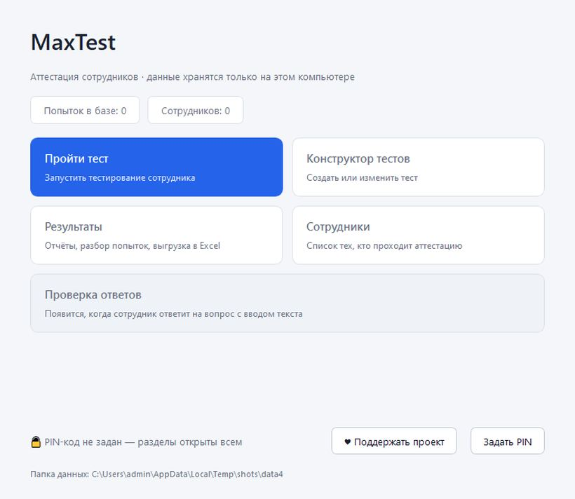
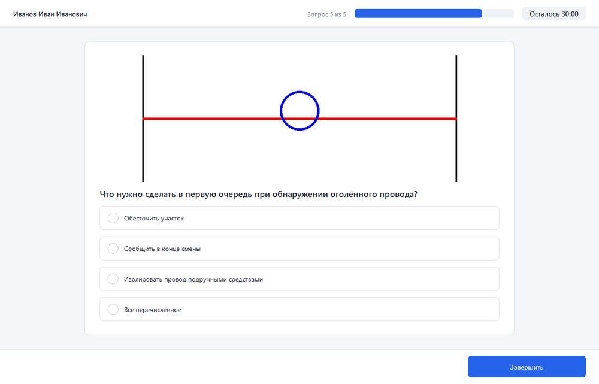
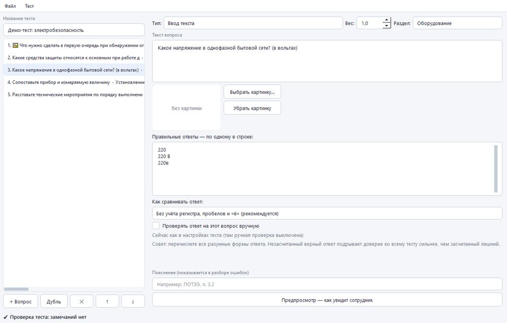
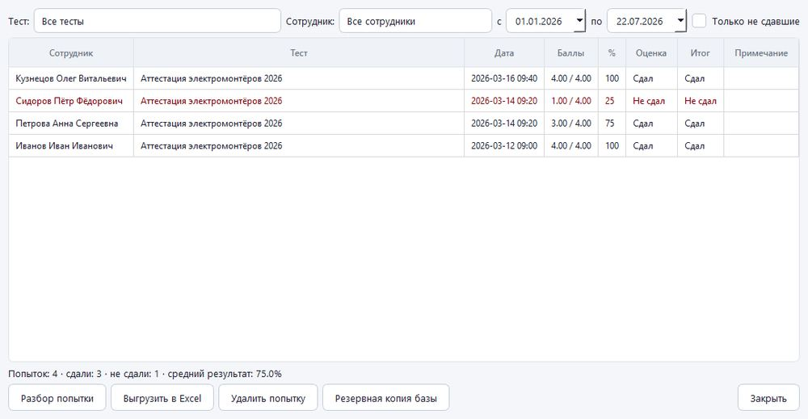
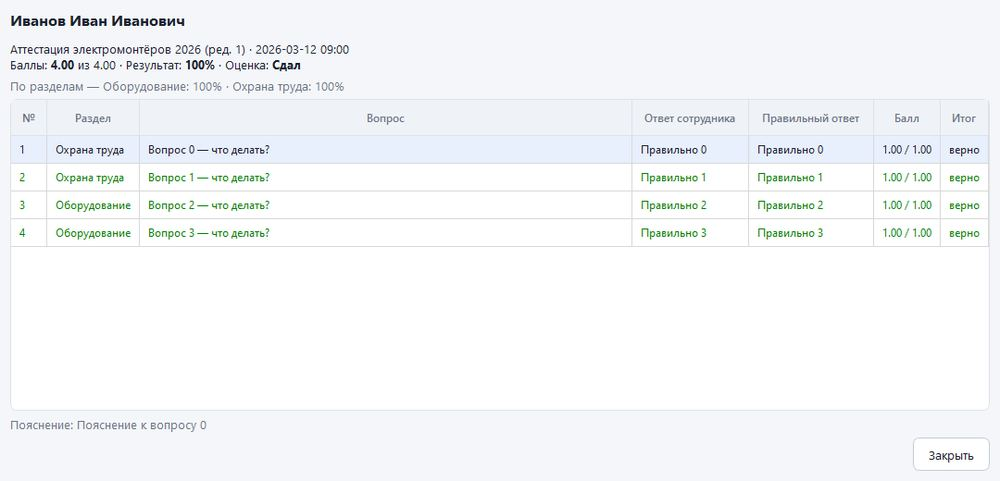

# MaxTest

**Бесплатная программа для проверки знаний сотрудников.** 
Создавайте тесты, проводите аттестацию и получайте готовые отчёты — 
прямо на своём компьютере, без интернета.

 

Windows 10 и 11 · 28 МБ · бесплатно навсегда

[Сайт программы](https://infomaxtest.ru) · [Поддержать проект](#поддержать-проект) · [Все версии](https://github.com/cefiro777/MaxTest/releases)

 

---

## Для чего она нужна

MaxTest помогает провести плановую проверку знаний: по охране труда,
электробезопасности, пожарной безопасности, должностным инструкциям — по любой
теме. Вы собираете тест, сотрудники по очереди проходят его на компьютере,
а программа сама считает баллы и готовит протокол.

**Ваши данные остаются у вас.** Программа не требует интернета и ничего
никуда не отправляет — ни фамилии сотрудников, ни их результаты. В отличие от
онлайн-анкет, всё хранится только на вашем компьютере.

## Что умеет программа

### Создание тестов

- **Пять видов вопросов:** один правильный ответ, несколько правильных, ответ
  своими словами, «сопоставьте пары» и «расставьте по порядку»
- **Картинки в вопросах** — схемы, фотографии оборудования, знаки безопасности
- **Сколько угодно вопросов** — можно собрать большой банк и задавать каждому
  сотруднику случайную выборку
- **Темы внутри теста** — например, «Охрана труда» и «Оборудование»: из каждой
  можно брать своё количество вопросов, а в отчёте видно, какая тема проседает
- **Важные вопросы стоят больше** — каждому вопросу можно задать свой вес в баллах
- **Подсказки при создании** — программа сама замечает ошибки: забытый
  правильный ответ, пустой вариант, потерянную картинку
- **Предпросмотр** — видно, как вопрос увидит сотрудник

### Проведение тестирования

- **Крупный и понятный экран** — удобно людям любого возраста
- **У каждого свой порядок** вопросов и ответов — списывать у соседа бесполезно
- **Ограничение по времени** — за пять минут до конца таймер подсвечивается,
  а когда время выходит, тест сдаётся автоматически
- **Сотрудник выбирает себя из списка** — не нужно каждый раз вводить фамилию
- **Ничего не теряется** — если компьютер выключится посреди теста, программа
  предложит продолжить с того же вопроса

### Оценка и отчёты

- **Своя шкала оценок** — «зачёт / незачёт», пятибалльная или любая другая
- **Честный подсчёт** — за частично верный ответ начисляется часть балла,
  а отметить все варианты наугад не выйдет
- **Проверка развёрнутых ответов вручную** — ответы своими словами можно
  прочитать и засчитать самому
- **Разбор каждой попытки** — что спросили, что ответил человек, как было правильно
- **Отчёт в Excel одной кнопкой** — сводная таблица, ответы по каждому вопросу,
  результаты по темам и список самых трудных вопросов
- **История за всё время** — результаты прошлых аттестаций сохраняются, база
  копируется автоматически

### Защита

- **PIN-код для администратора** — сотрудник видит только «Пройти тест», а
  конструктор с правильными ответами и результаты закрыты

## Как это выглядит

<table>
  <tr>
    <td width="50%"> <b>Прохождение теста</b> — крупные варианты ответа, таймер и прогресс</td>
    <td width="50%"> <b>Конструктор</b> — вопросы слева, редактирование справа</td>
  </tr>
  <tr>
    <td width="50%"> <b>Результаты</b> — кто сдал, кто нет, выгрузка в Excel</td>
    <td width="50%"> <b>Разбор попытки</b> — ответ сотрудника рядом с правильным</td>
  </tr>
</table>

## Как начать

1. **[Скачайте программу](https://github.com/cefiro777/MaxTest/releases/latest/download/MaxTest-Setup.exe)** и запустите файл.
2. Нажмите «Далее» несколько раз — права администратора не понадобятся.
3. Откройте MaxTest с рабочего стола и нажмите «Конструктор тестов» —
   можно сразу собирать свой первый тест.

Подробное руководство с картинками — на сайте **[infomaxtest.ru](https://infomaxtest.ru)**.

## Частые вопросы

**Это действительно бесплатно?** 
Да, полностью и без ограничений. Программу можно ставить на любое количество
компьютеров, в том числе в организации.

**Нужен ли интернет?** 
Нет. MaxTest работает без интернета — и при создании тестов, и при их прохождении.

**Сколько сотрудников можно проверить?** 
Сколько угодно — ограничений нет ни по людям, ни по вопросам.

**Windows пишет, что программа неизвестна. Это опасно?** 
Нет. Так Windows реагирует на любые новые программы без платной цифровой
подписи. Нажмите «Подробнее» → «Выполнить в любом случае».

## Поддержать проект

MaxTest — бесплатная программа и останется такой. Если она сэкономила вам
время, вы можете поддержать её развитие: отсканируйте код камерой телефона
в приложении своего банка (Система быстрых платежей). Сумма — любая.

Тот же код есть в самой программе — кнопка «Поддержать проект» внизу главного
окна. Ещё можно помочь, просто поставив проекту звёздочку ⭐ вверху этой страницы
или рассказав о нём коллегам.

---

Программа распространяется бесплатно по лицензии [MIT](LICENSE).
Сведения для разработчиков — в [docs/РАЗРАБОТЧИКАМ.md](docs/РАЗРАБОТЧИКАМ.md).
